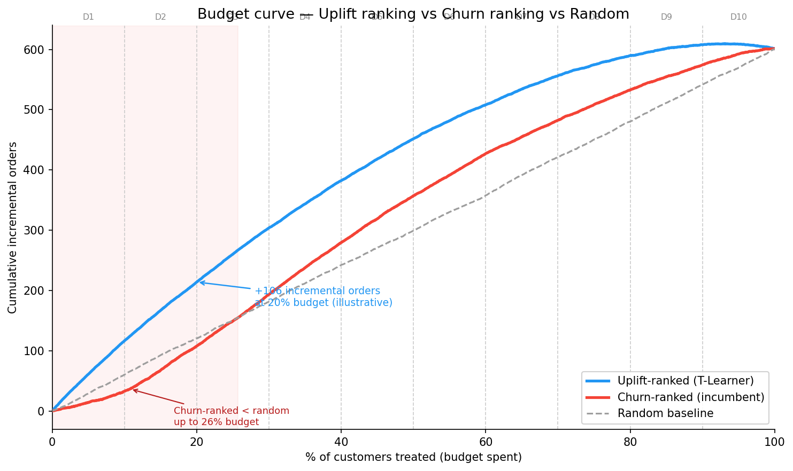
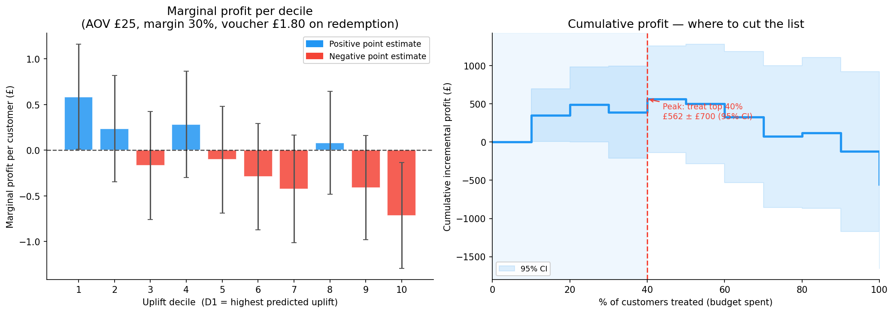

# Your Churn Model Tells You Who's Leaving, Not Who You Can Save

Companion notebook to the [Medium post of the same name](https://medium.com/@shrechak/your-churn-model-tells-you-who-s-leaving-not-who-you-can-save-21e00abedfb9) — an end-to-end uplift modelling pipeline (T-Learner + CatBoost) on synthetic food delivery data, built with a known ground-truth treatment effect so the model's evaluation methodology can be checked against it, not just asserted.

## Why synthetic data

In a real voucher campaign, you never observe the individual causal effect (τ) of the voucher on a given customer — only what happened, not what would have happened otherwise. This notebook constructs τ explicitly, which makes it possible to validate a claim that's impossible to validate on real campaign data: does the model's evaluation method (built only from what you'd actually observe — treatment and outcome) recover something close to the truth?

## Key findings

- **Churn risk ≠ voucher responsiveness.** `Corr(churn_risk, τ) ≈ 0.08` — near zero by design, and confirmed empirically. The two are structurally independent signals.
- **The incumbent (churn-ranked) targeting strategy underperforms doing nothing at all** for the first ~26% of budget. Churn risk loads on recency, pushing the most-lapsed customers to the top of the list — but they're already past the point where a voucher can recover them.
- **The T-Learner's score is directionally reliable but over-dispersed** (calibration slope ≈ 0.59): the ranking holds, but the magnitude of the predicted effect is inflated at the extremes. Verified against ground truth, then re-derived using only observed treatment/outcome data (no τ).
- **A profit-derived budget cutoff, not an arbitrary guess.** Given unit economics (AOV, margin, voucher cost — paid only on redemption), cumulative profit peaks at treating the top ~40% of the uplift-ranked list, worth an estimated £562 ± £700 (95% CI) in incremental profit.

<p align="center">
  
  
</p>

## Repo structure

```
uplift_modelling_voucher_targeting.ipynb   Main notebook — the full pipeline, end to end
src/dgp.py                                 Synthetic data-generating process (importable, seeded)
tests/test_dgp.py                          Property tests on the DGP (sleeping-dog rate, churn/τ
                                            independence, reproducibility, etc.)
docs/synthetic_data_generation.md          Full distribution rationale for every feature, and the
                                            τ formula derivation
images/                                    Saved chart outputs from the notebook
requirements.txt                           Pinned dependencies
```

## Notebook contents

1. Synthetic data generation — customers, randomised voucher treatment, ground-truth uplift
2. T-Learner with CatBoost, plus a calibration check against ground-truth τ
3. Budget curve — cumulative incremental orders: uplift-ranked vs churn-ranked vs random
4. Observable validation — estimating ATE from (T, Y) only, no τ needed, with confidence intervals
5. Profit analysis — deriving the optimal budget cutoff from campaign economics
6. BCG matrix — four quadrants from uplift and base scores

**Deliberately omitted (Part 3, coming):** a sleeping-dogs deep-dive, the Qini curve, and what productionising this actually requires.

## Running it

```bash
git clone git@github.com:shrechak/UpliftModeling.git
cd UpliftModeling
pip install -r requirements.txt
jupyter notebook uplift_modelling_voucher_targeting.ipynb
```

Then **Kernel → Restart & Run All**.

To verify the synthetic data-generating process independently of the notebook:

```bash
pytest tests/
```
